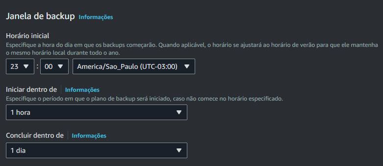
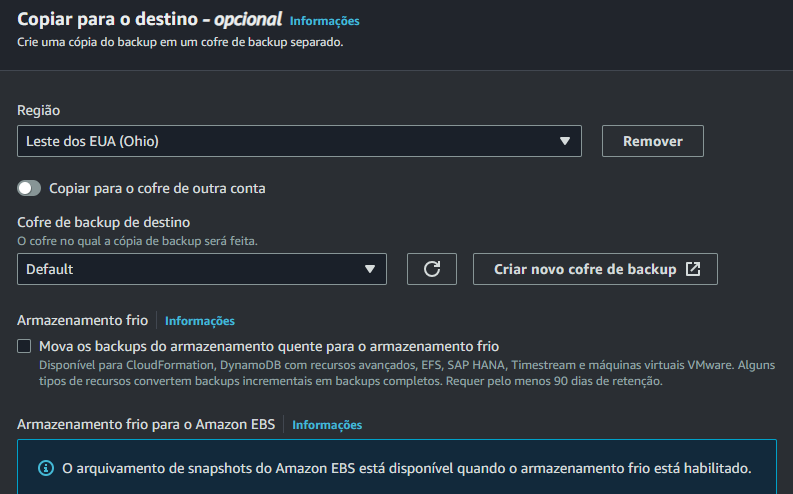
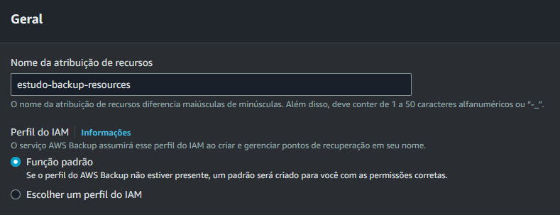

#  Estudos de AWS Backup

Serviço gerenciado da AWS para centralizar a gestão e automatizar backups de diversos serviços AWS.
Não é necessário criar scripts customizados e processos manuais.

> **Preço**:
>
> Com o AWS Backup, você paga apenas pelo armazenamento de backup que usa, dados de backup transferido entre as regiões da AWS, dados de backup que você restaura e avaliações de backup. Não há taxa mínima nem de custos de configuração.

Serviços suportados:

* Amazon EC2/ Amazon EBS;
* Amazon S3;
* Amazon RDS / Aurora / Dynamo DB;
* Amazon Document DB/ Amazon Neptune;
* Amazon EFS / FSx (Lustre & Windows File Server)
* AWS Storage Gateway (Volume Gateway).

Suporta backups Cross-Region e Cross-Account. 

Também é possível gerar backups on-demand ou agendados.

Suporta Tag-Based Backup Policies.

Você cria backup policies, que são chamadas de **Backup Plans**, configurando:

* Frequência de Backup (a cada 12h, dirios, semanais, mensais, cron expression);
* Janela de Backup;
* Transição para Cold Storage (Never, Days, Weeks, Months, Years);
* Período de Retenção (Always, Days, Weeks, Months, Years).

Também suporta recuperação pontual PITR (Point-in Time Recovery) com backups contínuos para poder restaurar recursos para um ponto específico do tempo com precisão de 1 segundo (e, no máximo, 35 dias de retrocesso). Disponível para Aurora, RDS, S3, SAP Hana e EC2.

---

### AWS Backup Vault Lock

Força o WORM State (Write Once Read Many) para todos os backups armazenados no seu AWS Backup Vault.

> **WORM**: cacarcterística de uma solução de storage onde uma vez que os dados são escritos, não podem ser modificados (imutáveis) ou apagados.

Possui camada adicional de defesa para proteger os backups contra:

* Operações de delete (acidental ou malicionso);
* Atualizações que diminuam ou alterem os períodos de retenção.

Até mesmo o root user não consegue deletar os backups quando habilitado.

---

### Prática: Criando Plano de Backup

#### 1. Criação do Plano de Backup

Inicialmente, é preciso escolher 1 de 3 opções de planos de backup.

* **Iniciar com um modelo**: você escolhe entre opções pré-definidas de planos de bacukp com:
    * Daily-35day-Retention;
    * Daily-Monthly-1yr-Retention, etc.

* **Criar um novo plano**: você configura do zero;

* **Definir um plano usando JSON**: você pode modificar o script JSON ou criar um novo para definir o plano de backup. Bem útil para trabalhar com versionamento e tratar o plano de backup como código.

Em seguida, é preciso configurar a programação do plano de backup.

> **Cofres de Backup**: os backups são armazenados no cofre de backup especificado. É possível criar seu próprio cofre de backup, usar um criado anteriormente ou armazenar seus backups no cofre padrão do AWS Backup.
>
> Somente cofres de backup padrão podem ser selecionados. Uma vez que um backup é armazenado aqui, ele pode ser copiado posteriormente em um cofre logicamente isolado.

Definir a janela de backup.

Habilitar ou não Point In Time Recovery.

Definir a política de ciclo de vida dos backups.

Configurar um destino para cópia dos backups em um cofre de backup separado, como se fosse um backup do backup.

É possível copiar para uma outra região ou para uma outra conta AWS.

Após criar o Plano de Backup, é possível atribuir recursos a ele.

#### 2. Atribuição de Recursos ao Plano de Backup

É nessa etapa que você especifica os recursos que terão backup.

Primeiro você dá um nome a atribuição de recursos e escolhe se usará uma IAM Role Padrão ou outra.

Em seguida, você escolhe se quer aplicar o backup a todos os recursos habilitados na conta (EC2, EBS, S3, RDS, etc) ou se aplicará a tipos de recursos específicos, por exemplo, apenas S3 e RDS.

Se você escolher a opção de tipos específicos, é possível selecionar recurso a recurso que terá o backup feito. Se selecionar todos os tipos de recurso, adicionalmente é possível aplicar um filtro por tag.

Por exemplo, no meu caso farei backup de todos os recursos na conta que tenham a tag {Backup = true}.

