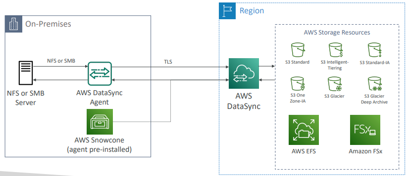
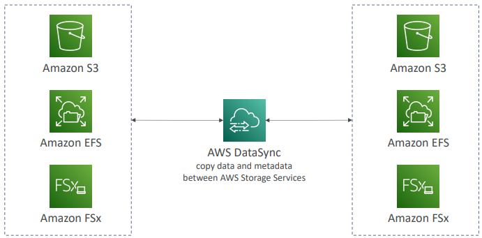

# AWS DataSync

Mova grandes volumes de dados de e para:

* Do on-premises ou outra numve para a AWS (NFS, SMB, HDFS, S3, API) - precisa de agent;
* Da AWS para a AWS (diferentes serviços de storage) - não precisa de agent.

Pode sincronizar:

* Amazon S3 (qualquer storage classes, incluindo Glacier);
* Amazon EFS;
* Amazon FSx.

Tasks de replicação podem ser agendadas a cada hora, dia, semana.

Um agent task pode usar 10 Gbps, pode configurar limites de banda de rede.

On-premises <--> aws:

aws <--> aws:

