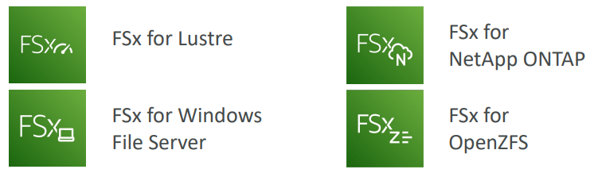
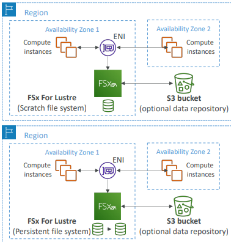
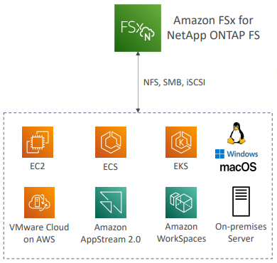

# Amazon FSx

Sistemas de Arquivos de alta performance de terceiros na AWS.
Serviço totalmente gerenciados.

---

## Amazon FSx for Windows (File Server)

Serviço gerenciado de Windows File System.

Suporta `SMB protocol` e Windows NTFS. Tem integração com Microsoft Active Directory.

Pode ser montado em `Linux EC2 Instances`.

Escala até dezenas de GB/s, milhões de IOPs, centenas de PB de dados.

Storage Options:

* SSD: workloads sensíveis a latência (database, media processing, data analytics);
* HDD: amplo espectro de cargas de trabalho (home directory, CMS).

Pode ser acessado de sua infraestrutura on-premises (VPN ou Direct Connect).

Pode ser configurado como `Multi-AZ`.

Dados têm backup diário no S3.

---

## Amazon FSx for Lustre

`Lustre` é um tipo de sistema de arquivos de distribuição paralela, para computação de larga escala.

O nome Lustre é derivado de Linux + Cluster.

Usado para:

* Machine Learning, High Performance Computing (HPC);
* Processamento de videos, Modelos Financeiros.

Storage Options:

* SSD: baixa latência, IOPs intensivos;
* HDD: throughput intensivos e sequenciais.

### File System Deployment Options

**Scratch File System**

* Storage temporário;
* Dado não é replicado (não persiste se o file server falhar);
* High Burst (6x mais rápido, 200MBps por TB);
* Uso: processamentos curtos, optmizando custo.

**Persistent File System**

* Storage de longa duração;
* Dado é replicado na mesma AZ;
* Repõe arquivos com falha em minutos;
* Uso: processamentos longos, dados sensíveis.

---

## Amazon FSx for NetApp ONTAP

NetApp ONTAP gerenciado pela AWS.

Sistema de arquivos compatível com NFS, SMB e iSCSI protocol.

Funciona com:

* Linux
* Windows
* MacOS
* VMware Cloud na AWS
* Amazon Workspaces e AppStream 2.0
* Amazon EC2, ECS e EKS.

Storage cresce e diminui automaticamente, replicação de snapshots, baixo custo, compressão e de-duplicação de dados.

Possui `point-in-time instantaneous cloning` (ajuda a testar novos workloads).

---

## Amazon FSx for OpenZFS

Sistema de arquivos OpenZFS gerenciado pela AWS.

Compatível com NFS (v3, v4, v4.1, v4.2).

Funciona com:

* Linux
* Windows
* MacOS
* VMware Cloud na AWS
* Amazon Workspaces e AppStream 2.0
* Amazon EC2, ECS e EKS.

Atém 1.000.000 IOPs com < 0.5ms de latência.

Snapshots, compressão e baixo custo.

Possui `point-in-time instantaneous cloning` (ajuda a testar novos workloads).