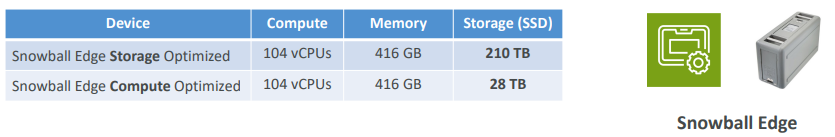
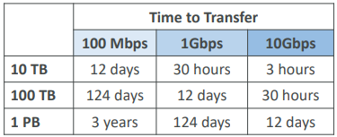
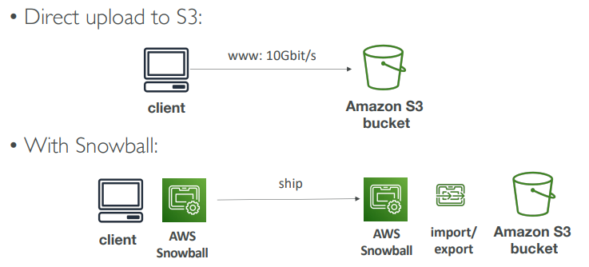
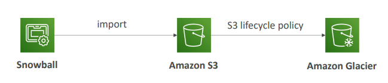

# AWS Snowball

Dispositivo portátil de alta segurança para coletar e processar dados na borda (edge) e migrá-los para a AWS.

Ajuda a migrar até petabytes de dados.

Tempo para migrar volume de dados com base no tamanho da banda de rede disponível na empresa:

**Desafios:**

* Conectividade limitada;
* Banda de rede limitada;
* Alto custo de rede;
* Banda de rede compartilhada (não sendo possível maximizar);
* Estabilidade de conexão.

Se a migração através da rede levar mais que uma semana, use snowball devices.

---

## Edge Computing

Processamento de dados enquanto eles estão sendo criados em um `edge location`.

Pode ser em um caminhão na estrada, um navio no oceano, uma estação de mineração e outros locais remotos com acesso limitado a internet e recursos de computação.

Snowball Edge devices fornecem:

* Snowball Edge Compute Optimized e Storage Optimized;
* Executar EC2 Instances ou Lambda Functions.

---

## Snowball x Glacier

Snowball `não consegue` importar dados diretamente para o Glacier.

É preciso importar para o S3 primeiro, e através de lifecycle policy mover os dados para o Glacier.

