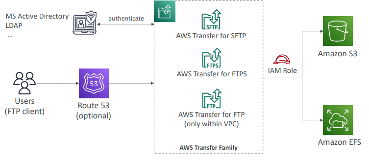

# AWS Transfer Family

Serviço totalmente gerenciado pela AWS para transferência de arquivos de e para o Amazon S3 ou Amazon EFS, usando protocolo FTP.

Protocolos suportados:

* AWS Transfer for FTP (File Transfer Protocol);
* AWS Transfer for FTPs (File Transfer Protocol over SSL);
* AWS Transfer for SFTP (Secure File Transfer Protocol).

Infraestrutura gerenciada, escalável e alta disponibilidade (miulti-AZ).

Pague por endpoint provisionado por hora + data transfer em GB.

